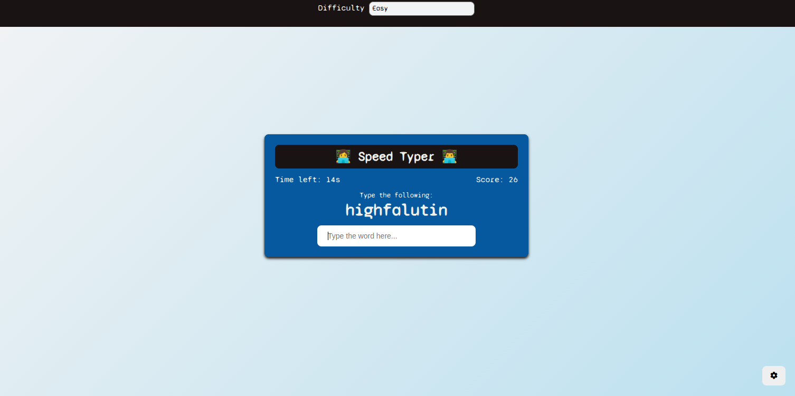

# Speed Typer Game

A simple and fun speed typing game built using **HTML, CSS, and JavaScript**.

## Demo

> Add an actual screenshot of the game in your repository and update the file name accordingly.

## Features
- Random words appear for the player to type.
- Timer countdown that ends the game when it reaches zero.
- Score increases for each correctly typed word.
- Difficulty levels (**Easy, Medium, Hard**) affect the time gained for each correct word.
- Settings panel to change difficulty.

## Technologies Used
- **HTML** for structuring the game layout.
- **CSS** for styling with a modern and responsive design.
- **JavaScript** for game logic and interactivity.

## Installation
1. Clone the repository:
   ```sh
   git clone https://github.com/bhramarambha8660/typing-game
   ```
2. Navigate to the project directory:
   ```sh
   cd typing-game
   ```
3. Open `index.html` in your browser.

## Usage
- Start typing the displayed word into the input field.
- Each correct word increases your score and adds time based on difficulty level.
- The game ends when the timer reaches zero.
- Click the **Settings** button to change difficulty.

## Files Structure
```
|-- speed-typer/
    |-- index.html    # Main HTML file
    |-- style.css     # Stylesheet for design
    |-- script.js     # JavaScript file for game logic
    |-- demo.png # Add your screenshot here
    |-- README.md     # This file
```

## License
This project is open-source and available under the **MIT License**.

---

Enjoy the game! 🚀

